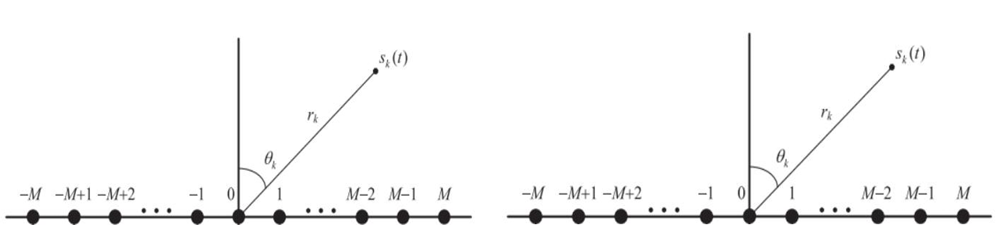
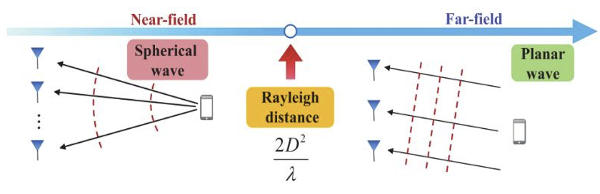
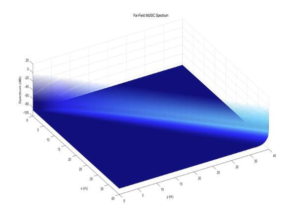
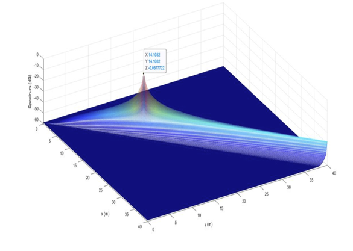

# Detailed Experiment Report: Near-Field Integrated Sensing and Communications

**Group Number**: [17]  
**Course ID**: [MCE 6005  5G and Beyond Communications and Networks]  

---

## Group Members
| Student Name       | Student ID     |
|--------------------|----------------|
| [Li Wenli]   | [224010040] |
| [Deng Haiqian]   | [224010045] |
| [Xu Jiajun]   | [224010072] |

---

- [1. Introduction](#1-introduction)
- [2. System Model and Framework](#2-system-model-and-framework)
  - [2.1 Near-Field vs. Far-Field Communication](#21-near-field-vs-far-field-communication)
  - [2.2 Joint Signal Transmission](#22-joint-signal-transmission)
- [3. Performance Analysis and Optimization](#3-performance-analysis-and-optimization)
  - [3.1 Optimization Problem](#31-optimization-problem)
  - [3.2 MUSIC Algorithm for Sensing](#32-music-algorithm-for-sensing)
- [4. Simulation Results](#4-simulation-results)
  - [4.1 Simulation Setup](#41-simulation-setup)
  - [4.2 Near-Field vs. Far-Field Performance](#42-near-field-vs-far-field-performance)
  - [4.3 Simulation Insights](#43-simulation-insights)
- [5. Results and Discussion](#5-results-and-discussion)
  - [5.1 Sensing Performance](#51-sensing-performance)
  - [5.2 Simulation Insights](#52-simulation-insights)
- [6. Conclusion](#6-conclusion)
- [7. AI Usage Statistics](#7-ai-usage-statistics)
- [8. References](#8-references)

---

## 1. Introduction
The rapid evolution of wireless communication systems has led to an increasing demand for technologies that can handle multiple tasks simultaneously. One of the emerging paradigms is **Near-Field Integrated Sensing and Communications (NF-ISC)**, which merges the capabilities of communication and sensing into a single system. This approach addresses the growing need for efficient data transmission and real-time environmental monitoring, such as location tracking, target detection, and environmental sensing.

Traditional wireless communication systems primarily focus on transmitting data, while sensing tasks (e.g., localization and environmental sensing) have often been handled separately by specialized systems. However, NF-ISC combines both tasks, enabling more efficient use of resources, improved accuracy, and faster response times. The near-field communication and sensing approach also provides better performance in dense environments, where users are located closer to the base station.

This report examines the theoretical framework, performance analysis, and optimization techniques for NF-ISC systems. Additionally, we will explore the simulation results that demonstrate the practical advantages of this unified system.

---

## 2. System Model and Framework

### 2.1 Near-Field vs. Far-Field Communication

The propagation characteristics of wireless communication signals are fundamentally determined by the distance and angle between the transmitter and receiver.

#### 

*Figure 2.1-1 array response vector of Near-field and far-field*

- **Near-Field Propagation Characteristics**: In the near-field region, the distribution of electric and magnetic fields governs the signal propagation. When the distance between users and the base station is small (within a few wavelengths of the transmission frequency), the signal propagation is heavily influenced by these fields. This allows near-field communication to provide higher precision and resolution at short distances.

- **Far-Field Propagation Characteristics**: In contrast, far-field communication systems rely on the propagation of plane waves. The signal attenuation and multipath interference result in lower localization accuracy. Thus, far-field communication systems typically face significant performance challenges in dense environments.

#### 

*Figure 2.1-2 Difference between near-field and far-field*

### 2.2 Joint Signal Transmission

One of the core innovations of NF-ISC is the **joint transmission of communication and sensing signals**. In traditional systems, communication and sensing are treated as separate processes, often requiring different resources. NF-ISC, however, combines both into a single transmission.

The base station transmits a **joint signal** that carries both the communication data and the sensing information. The communication rate for user *k* can be represented by:

$$
R_k = \log_2 \left(1 + \frac{P_k}{N_0 \cdot d_k^\alpha} \right)
$$

Where:

- \( R_k \) is the communication rate for user *k*
- \( P_k \) is the transmission power
- \( N_0 \) is the noise power density
- \( d_k \) is the distance from the base station to user *k*
- \( \alpha \) is the propagation loss factor

To jointly carry out communication and sensing, the base station transmits:

$$
X[t] = \sum_{k \in K} f_k c_k[t] + s[t]
$$

where \( f_k \) represents the fully digital beamformer for user *k* and \( s[t] \) is the dedicated sensing signal.

---

## 3. Performance Analysis and Optimization

### 3.1 Optimization Problem

The performance of NF-ISC depends on the **joint optimization** of both communication and sensing tasks. The goal is to **minimize the Cramer-Rao Bound (CRB)** (which quantifies uncertainty in parameter estimation) while ensuring the communication rate remains above a specified threshold.

Optimization Objective:

$$
\min CRB + \max R_k
$$

where CRB represents sensing accuracy, and \( R_k \) is constrained by power and noise characteristics.

### 3.2 MUSIC Algorithm for Sensing

To improve sensing accuracy, NF-ISC uses the **MUSIC (Multiple Signal Classification) algorithm**, which is a subspace-based technique for high-resolution parameter estimation. The MUSIC algorithm exploits eigenvalues of the signal covariance matrix to estimate parameters such as angle of arrival (AoA) and distance.

$$
P_{MUSIC}(\theta, d) = \frac{1}{\mathbf{a}^H(\theta, d) \mathbf{E}_N \mathbf{E}_N^H \mathbf{a}(\theta, d)}
$$

MUSIC significantly enhances system performance in near-field environments by improving parameter estimation accuracy.

---

## 4. Simulation Results

### 4.1 Simulation Setup

The simulations were performed using the following parameters:

- **Number of Transmit Antennas**: 65
- **Transmit Power**: 20 dBm
- **Number of Users**: 4
- **Noise Power**: -60 dBm
- **Target Distance**: 20m (near-field) and 80m (far-field)
- **Rayleigh distance**: 46.667m
- **Target Angle**: 45°
- **Carrier Frequency**: 28 GHz
- **Antenna Aperture**: 0.5m

### 4.2 Near-Field vs. Far-Field Performance

#### **Key Observations**:

- **Near-Field Systems**:  Achieve precise spatial resolution, capable of distinguishing different positions within the same directional sector.
- **Far-Field Systems**: Demonstrate limited spatial discrimination, primarily distinguishing angular differences without positional specificity.

- #### 

*Figure 4.1-1 Simulation result of far-field*

#### 

*Figure 4.1-2 simulation result of near-field*

### 4.3 Simulation Insights

- **Effectiveness of MUSIC Algorithm**: MUSIC enables high-resolution parameter estimation even in noisy environments.

---

## 5. Results and Discussion

### 5.1 Sensing Performance

Near-field systems outperform far-field systems in. In dense environments with users closer to the base station, NF-ISC provides:

- **Higher localization accuracy**

### 5.2 Simulation Insights

- **MUSIC algorithm enhances sensing capabilities, making it useful for target localization in noisy environments.**

---

## 6. Conclusion

The **Near-Field Integrated Sensing and Communications (NF-ISC) framework** represents a significant advancement in wireless communication. By integrating **communication and sensing**, it enables **efficient resource utilization and better system performance**.

Simulation results confirm that **NF-ISC achieves sensing accuracy compared to traditional systems**. This opens new possibilities for autonomous vehicles, industrial IoT, and smart cities.

Future research will focus on:
- **Further optimization of joint communication and sensing strategies**
- **Exploring real-world implementation challenges**

---
## 7. AI Usage Statistics
To enhance research efficiency, we employed AI-assisted content generation during the report preparation phase.

## 8. References  
1. *H. Zhang, N. Shlezinger, F. Guidi, D. Dardari, M. F. Imani and Y. C. Eldar, "Beam Focusing for Near-Field Multiuser MIMO Communications," in IEEE Transactions on Wireless Communications, vol. 21, no. 9, pp. 7476-7490, Sept. 2022, doi: 10.1109/TWC.2022.3158894.*
2. *Z. Wang, X. Mu and Y. Liu, "Near-Field Integrated Sensing and Communications," in IEEE Communications Letters, vol. 27, no. 8, pp. 2048-2052, Aug. 2023, doi: 10.1109/LCOMM.2023.3280132.*
3. *余显祥,姚雪,杨婧,等. 面向感知应用的通感一体化信号设计技术与综述[J]. 雷达学报,2023,12(2):247-261. DOI:10.12000/JR23015.*.  

